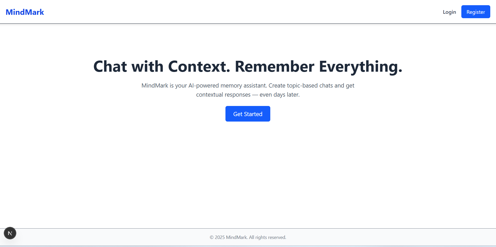
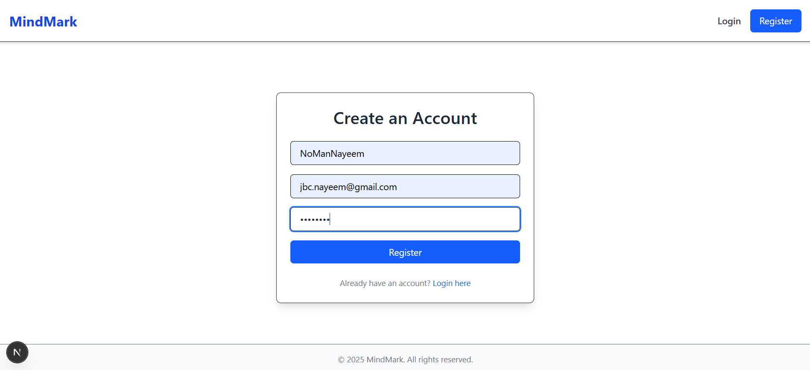
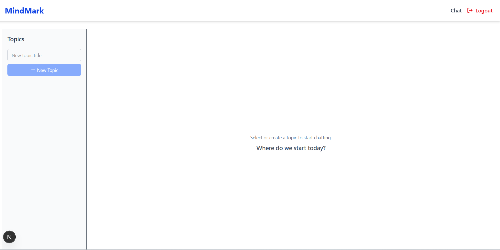
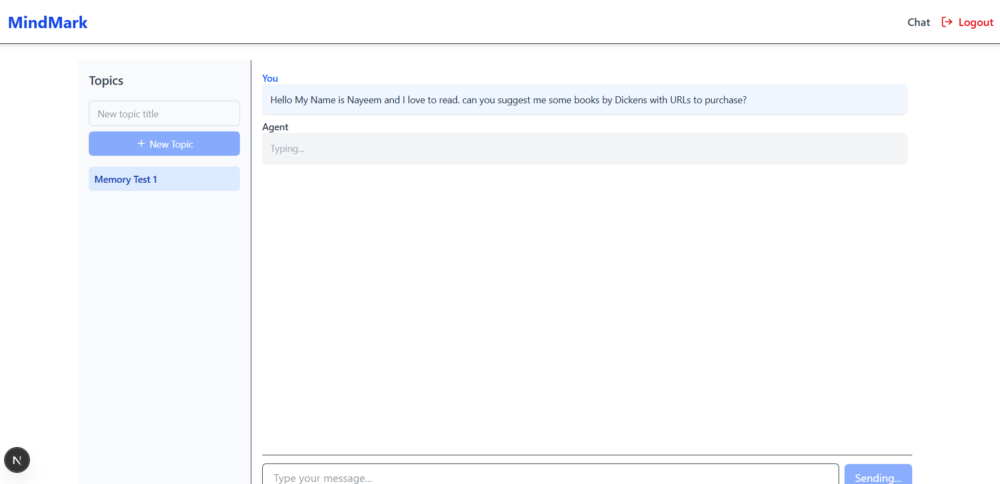
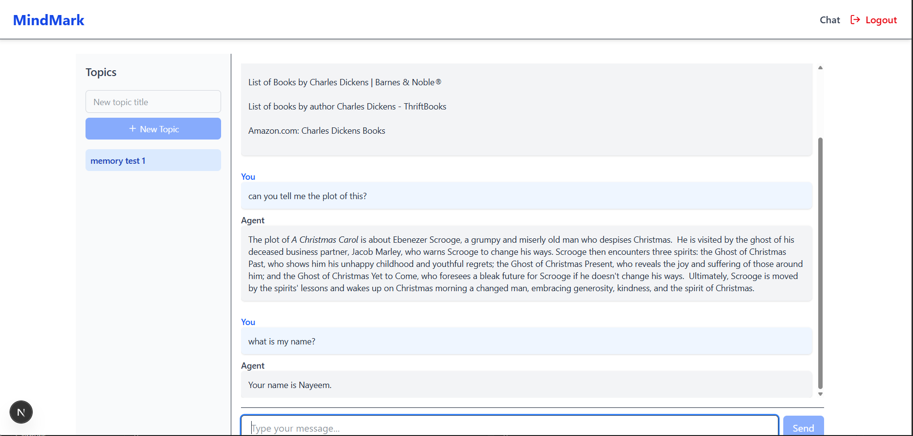
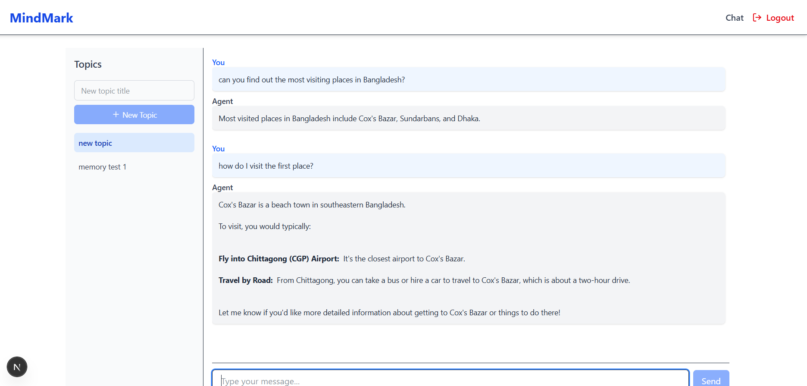

# 🧠 MindMark

MindMark is a full-stack AI-powered assistant designed to help users organize thoughts, conduct research, and hold contextual conversations across topics.

It uses:
- A Django + DRF backend with long-term memory support
- A Next.js frontend for interactive chatting
- Agno for agent memory, Groq for language models, and Tavily for real-time search

## 🔧 Installation & Setup

### 1. Clone the repository
```bash
git clone https://github.com/NoManNayeem/mindmark.git
cd mindmark
```

### 2. Backend Setup (Django)
```bash
cd mindmark_backend
python -m venv venv
venv\Scripts\activate  # or source venv/bin/activate
pip install -r requirements.txt
cp .env.example .env
python manage.py migrate
python manage.py runserver
```

### 3. Frontend Setup (Next.js)
```bash
cd ../mindmark-frontend
npm install
npm run dev
```

## 🧪 Usage

1. Register or log in through the frontend interface.
2. Create or select a topic to begin chatting.
3. Your chat history and personal preferences are remembered via contextual memory.
4. Use the assistant to:
   - Ask research questions.
   - Search the web (Tavily integration).
   - Transcribe, translate, or generate speech (Groq tools).

> All conversations are scoped to your topic and stored with memory for continuity.
## 🧠 Features

- ✅ Context-aware AI assistant with long-term memory
- 🧵 Topic-based chat organization
- 🔐 Authenticated user sessions with JWT
- 🌐 Web search integration via Tavily API
- 🎙️ Groq-based tools for transcription, translation & TTS
- 📝 Markdown-supported message rendering

## ⚙️ Tech Stack

### Frontend
- Next.js (App Router)
- Tailwind CSS
- React Markdown

### Backend
- Django + Django REST Framework
- Agno SDK (Agents, Memory, Tools)
- JWT Authentication

### Tools
- Tavily Search API
- Groq API (LLMs + audio tools)

## 🚀 Getting Started

### Prerequisites
- Python 3.11+
- Node.js (LTS)
- PostgreSQL (optional, default is SQLite)
- Groq & Tavily API keys

### Backend Setup
```bash
cd mindmark_backend
python -m venv venv
venv\Scripts\activate  # or source venv/bin/activate
pip install -r requirements.txt
cp .env.example .env
python manage.py migrate
python manage.py runserver
```

### Frontend Setup
```bash
cd mindmark-frontend
npm install
cp .env.example .env  # create your own if missing
npm run dev
```

## 🧠 Agent Memory & Tools

This project uses the [Agno SDK](https://docs.agno.com) to build a memory-aware research assistant.

### Memory
- Long-term memory via SQLite
- Session-specific memory with `user_id` and `topic_id`
- Agentic memory enabled to let the assistant learn and evolve

### Tools Integrated
- 🔍 **Tavily Search**: Web search integration via Tavily API
- 🗣️ **Groq Tools**: Transcription, translation, and speech generation

> Make sure to set `TAVILY_API_KEY` and `GROQ_API_KEY` in your environment.

## 📁 Project Structure

```
MindMark/
├── .env                 # Root environment variables
├── mindmark_backend/    # Django backend
│   ├── agent/           # Core agent logic and views
│   ├── db.sqlite3       # Django DB
│   ├── memory.sqlite3   # Agent memory DB
├── mindmark-frontend/   # Next.js frontend
│   ├── app/             # Pages and components
│   ├── public/          # Static assets
├── notebooks/           # Experiments and demos
├── venv/                # Python virtual environment
```


## 📸 Screenshots

Below are some key screens from the app:

<p align="center">
  
  
  
</p>

<p align="center">
  
  
  
</p>
